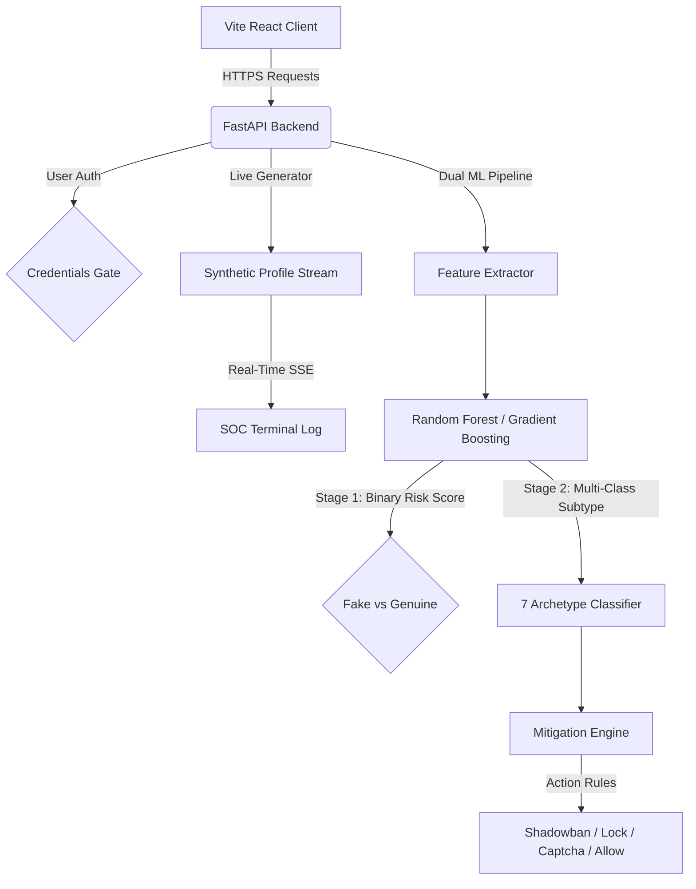

# 🛡️ SybilGuard: Enterprise AI Deception & Threat Intelligence Platform

[](https://fastapi.tiangolo.com)
[](https://reactjs.org)
[](https://scikit-learn.org)
[](https://python.org)
[](https://opensource.org/licenses/MIT)

**SybilGuard** is a production-grade, full-stack cybersecurity platform designed to detect malicious social media fake accounts, spambots, and coordinated inauthentic behavior. Combining a dual-pipeline machine learning classifier with custom NLP heuristics, SybilGuard identifies threat actors in real-time, displaying live telemetry on a premium glassmorphic Security Operations Center (SOC) dashboard.

---

## 📸 Dashboard Preview

* **Gated SOC Portal**: Access control managed via cryptographic mock JWT auth.
* **Live Audit Stream**: Real-time SSE flow classifying user profiles dynamically.
* **Multi-Class Detection**: Specialized classifier for 7 distinct account archetypes.
* **Interactive Model Tuning**: Hyperparameter adjustment and dynamic retraining directly from the UI.

---

## ⚙️ Core Architecture & Flow

SybilGuard operates on a multi-stage classification pipeline:
1. **Feature Extractor**: Normalizes profile metadata (followers/following ratios, post frequencies) and runs NLP text analysis (sentiment scoring, spam keyword frequency, casing ratios, and lexical diversity).
2. **Binary Risk Assessment**: Computes a probability score indicating overall malicious intent.
3. **Multi-Class Categorization**: Maps the account to a specific archetype if it crosses the risk threshold.



---

## 🎯 Account Archetypes Classified

SybilGuard identifies 7 distinct account classes:

| Class | Type | Primary Indicator | Automated Mitigation |
| :--- | :--- | :--- | :--- |
| **Genuine User** | Organic | High lexical diversity, stable post rate, positive/neutral posts. | `Allow Profile & Badge` |
| **Commercial Spambot** | Malicious | High spam-word frequency, high link density, high post rate. | `Suspend Account` |
| **Inactive Follower Bot** | Malicious | Zero posts, empty bios, high following/follower ratio. | `Flag for Audit` |
| **Celebrity Impersonator** | Malicious | Slight handle typos, high following, links asking for payment/DMs. | `Force Captcha Gate` |
| **Data Harvester / Scraper** | Bot | Extreme posting frequency, repetitive patterns, high following counts. | `Rate Limit IP` |
| **Political Astroturfer** | Bot | High-frequency posts containing coordinated political keywords. | `Shadowban Account` |
| **Compromised / Hijacked** | Compromised | Older legitimate account suddenly posting links/spam content. | `Lock & Password Reset` |

---

## 🛠️ Tech Stack & Key Technologies

* **Backend Engine**: FastAPI, Uvicorn, Scikit-learn (RandomForest, GradientBoosting, LogisticRegression), Pandas, NumPy, SSE-Starlette.
* **Frontend UI**: React (Vite), Vanilla CSS (Custom Glassmorphism Design System), Lucide React.
* **Control Launcher**: Python multi-threaded subprocess supervisor (`run.py`).

---

## 🚀 Getting Started

### Prerequisites

* Python 3.10+
* Node.js 18+ & npm

### Installation & Run

Launch both servers using our automatic dependency-installer and launcher script:

```bash
# Clone the repository
git clone https://github.com/rohanramgopal/fake_account_detection.git
cd fake_account_detection

# Run the project launcher
python run.py
```

The script will:
1. Verify and install Python requirements.
2. Install Node frontend dependencies.
3. Boot the FastAPI server on `http://127.0.0.1:8000`.
4. Boot the React dev server on `http://localhost:5173`.

---

## 🔐 Administrative Credentials

The SOC Dashboard is gated behind an authentication portal. Use the following credentials:
* **Username**: `admin`
* **Security Password Key**: `sybilguard2026`

---

## 📡 API Reference

### 1. Authenticate SOC Manager
* **Endpoint**: `POST /api/login`
* **Payload**:
  ```json
  {
    "username": "admin",
    "password": "sybilguard2026"
  }
  ```

### 2. Inspect Single Account
* **Endpoint**: `POST /api/analyze`
* **Payload**:
  ```json
  {
    "username": "crypto_guru99",
    "display_name": "⚡ Crypto Guru ⚡",
    "bio": "Double your Bitcoin in 24 hours! 100% legit giveaway!",
    "has_profile_pic": 1,
    "has_link_in_bio": 1,
    "followers_count": 85,
    "following_count": 2400,
    "posts_count": 650,
    "posts_frequency": 18.5,
    "recent_posts": ["CLAIM FREE CRYPTO NOW!", "Double coins today!"]
  }
  ```

### 3. Dynamic Model Retraining
* **Endpoint**: `POST /api/model/retrain`
* **Payload**:
  ```json
  {
    "classifier_type": "gradient_boosting",
    "n_estimators": 100,
    "max_depth": 8,
    "test_size": 0.2
  }
  ```

---

## 👤 Developer & Maintainer

* **Rohan Ramgopal**
  * GitHub: [@rohanramgopal](https://github.com/rohanramgopal)

